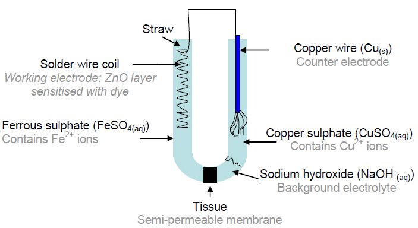

# 吸管太阳能电池

## 教师笔记

吸管太阳能电池是一种很好的教学实验，它让学生在自己学校的实验室中使用便宜易得的材料制造自己的太阳能电池。吸管太阳能电池背后的机理与染料敏化太阳能电池（Dye-Sensitised Solar Cell，DSSC）中使用的机理相似，但使用了不同的电解质和电极材料证实这一概念。 下面概述了实验背后的化学过程。 有关制作电池或采购器材的信息，请分别参阅“说明”和“技术员的说明”文档。

### 化学背景知识

<u>吸管电池</u>

下图是吸管太阳能电池的各个组件及其用途的示意图。

（图片配字有待修为中文）

<u>电池中的半反应方程式</u>

| 半反应方程式                                                 | 电极电位 |
| ------------------------------------------------------------ | -------- |
| $Cu^{2+}_{(aq)} + 2e^{-} \rightleftharpoons Cu_{s}Cu^{2+}_{(aq)} + 2e^{-} \rightleftharpoons Cu_{s}$ | +0.34V   |
| $Fe^{3+}_{(aq)} + e^{-} \rightleftharpoons Fe^{2+}_{aq}$     | +0.77V   |

$$
Cu^{2+}_{(aq)} + 2e^{-} \rightleftharpoons Cu_{s}
$$

$$
Fe^{3+}_{(aq)} + e^{-} \rightleftharpoons Fe^{2+}_{aq}
$$

🚧

<u>工作电极</u>

### 实验过程中

### 扩展

由本实验可以设计出一些相关的研究项目。 下面是一些参考方向。 

- 改变吸管的颜色。使用不同的有色吸管的电池会有不同的电压和电流值，因为它们没有吸收相同的太阳光谱的部分。 
- 更换染料。许多种类的水果和蔬菜都含有合适的染料分子（花青素）。 
- 改变照射在电池上的光强。 
- 改变对电极/工作电极的表面积比值。
- 调查其他合适的电解质化合物。
- 将电池机理与标准染料敏化太阳能电池进行比较。 

### 与其他课程的联系

- 光学：光的吸收，色彩
- 电学：串并联电路，电压与电流，电化学，电极电位，反应性
- 可再生能源：太阳能，能量储存，设计新技术时的安全与可行性考虑

### 安全

### 参考资料

本实验改编自一篇期刊论文。原始论文载于:

S.J. Appleyard, Physics Education, Volume 3, Issue 3, May 2008, pages 270-279.