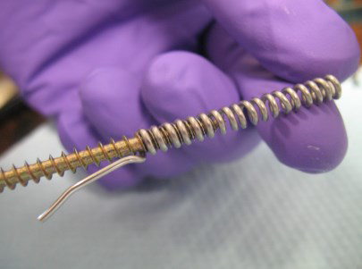
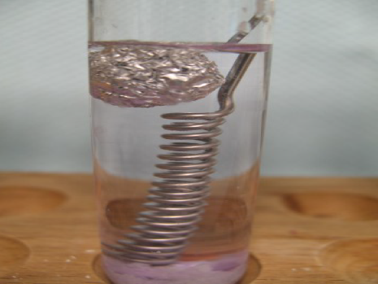
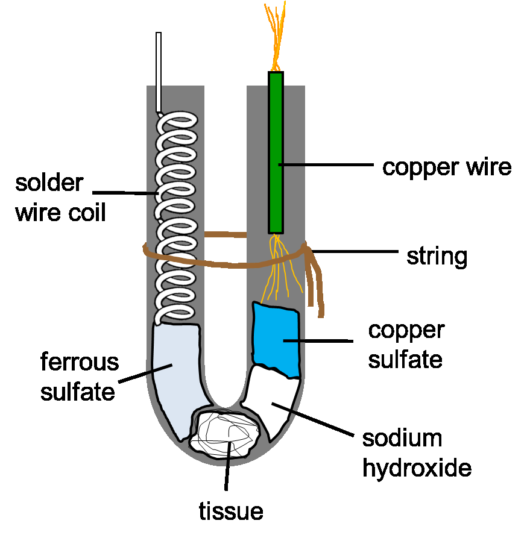

# 吸管太阳能电池

## 简介

在这个实验中，你将使用吸管制作一个太阳能电池。一份吸光性能良好的覆盆子果汁🍹，一点优美而简洁的化学，你就可以捕获到太阳光中的电能啦！祝你享受这一实验~

## 实验器材清单

试管架

3根试管

1根吸管

25cm长的焊锡丝

6厘米两端剥去塑料涂层的铜线

火柴

茶蜡蜡烛🕯

隔热垫

25mL量筒

餐巾纸

剪刀✂

锥形瓶

2个1mL塑料移液器

铁架台

食品袋扎带

铝箔

镊子

覆盆子

玻璃棒

明亮的光源 (1~2个)

小瓶methylated spirits

小瓶装的

- 硫酸铜
- 硫酸亚铁
- 硫酸锌
- 氢氧化钠
- 氨水

药匙

杵和臼

万用表和探头

2条鳄鱼夹线

## 方法

1.在吸管可弯曲的位置扭出一个“U”形。

2.用剪刀将较长的一半剪短，使吸管的两截一样长。到现在，你应该有了一个“U"形吸管，和一个长而直的吸管。

3.将长而直的吸管宜45°角剪为三等分，它们将在后续步骤中作为勺子使用。保留好这些准备的材料。

### 制作工作电极

4.用剪刀从准备的25cm焊锡丝剪掉1cm，保留它们用于下面的步骤。

5.将其余的焊锡丝缠绕在螺纹的凹槽之间，以形成一个线圈，该线圈的长度应与U形吸管的一个臂的长度相同。 **留出至少2cm的未缠绕电线作为手柄**。

6.旋转扭动螺钉来把它从线圈中取出来（好像拧松螺钉一样）。 你可能需要螺丝刀的帮助。

7.确保线圈**容易**插入吸管。 如果不容易插入，可以试着稍稍拉伸线圈来让它变苗条。

8.用量筒量出10mL的methylated spirits。 将其倒入一支试管。

9.用药匙向该试管1加入一勺的硫酸锌粉末，再加入之前剪下来的1cm长焊锡丝。

10.用塑料移液器向试管加入2mL氨水。

11.将一小撮铝箔卷成直径约1cm的小球，然后放入试管中。

12.最后向试管加入焊锡丝线圈，使**除了未卷曲的手柄之外**的部分完全浸没。静置10分钟。

13.等待的时候，再用量筒量出10mL的methylated spirits，将其倒入第二支干净的试管中。

14.加入1药匙硫酸锌粉末，并用纸巾清洁药匙。然后加入约4或5个氢氧化钠颗粒。

15.接下来，取出覆盆子，用玻璃棒或药匙将它们捣碎，倒入第三支干净的试管中。

16.步骤12的10分钟静置时间到，用镊子取出线圈，并用纸巾轻轻擦拭，以除去线圈表面的大块固体。然后将线圈放入第二个试管中，静置1分钟。静置后，取出线圈，用纸巾擦拭，然后用小块铝箔纸轻轻包裹。

17.将茶蜡蜡烛放在隔热垫上，并用火柴点燃。用镊子夹住箔纸包裹的线圈，在火焰上方约5cm处左右缓慢摆动1分钟（应≤1分钟）。**如果没有到1分钟时就出现冒烟现象，则说明焊锡丝线圈即将融化，因此应将其从热源中提前移出**，让它冷却。

18.取下包裹线圈的铝箔，将线圈放入盛有覆盆子汁的试管中，**使手柄保持在果汁液面之上**。把线圈保留在果汁中，下一步我们组装电池。

### 组装电池 

18.将大约拇指末端大小的一小块纸巾推入U形吸管的转折点中。可以用螺钉将其推入到位。

19.在研钵中倒入几粒氢氧化钠，然后用杵将其研磨成小块，将其装入吸管中。 （**⚠警告**：氢氧化钠具有腐蚀性，可能灼伤皮肤）使用吸管勺将1或2勺氢氧化钠放入吸管的一只臂中，使其占据约0.5cm。

20.使用另一只勺子将约3勺（或1cm）硫酸铜放入吸管，盖于氢氧化钠之上。

21.用第三个干净的勺子将3勺（或1cm）的硫酸亚铁放入”U”形吸管的**另一臂**中。

22.把吸管转折点固定在基座上，从而将吸管电池置于铁架台上，然后用食物袋扎带（或细绳）将两极系起来，如图所示。

（图片配字有待修为中文）

23.从覆盆子汁中取出线圈，用纸巾拭去线圈表面的固体。将线圈推入**装有硫酸亚铁的臂**中。

24.将两端剥去塑料涂层的铜线的一端插入含有氢氧化钠和硫酸铜的臂中。

25.将一些自来水倒入锥形瓶中。

26.用移液管将自来水加入到吸管的两臂中，**先加满含有线圈的臂**。

27.将鳄鱼夹线的一端连接到焊锡丝线圈的手柄，另一端连接到一个万用表探头。

28.取另一条鳄鱼夹线，将其一端连接到铜线，另一端连接到另一万用表探头。

### 测量

29.将万用表的量程转盘转到2000mV，测量电池的电压。 如果没有得到读数，请检查吸管中是否有气泡。，水需要贯通吸管电池才能工作，轻轻挤压吸管以清除气泡。

30.将万用表的量程转盘转到2000μA，测量电池中的电流。

31.现在，将明亮的光线照射到电池上，看看电流是否改变。 再将明亮的光撤去，会发生什么？再切换回万用表测量电压，电池电压改变了吗？
一个单电池不足以提供足够的功率，但是如果我们在串联更多电池，则可能可以增加输出功率。 与身边的其他小组合作，连接一个含有两个电池的串联电路。 使用万用表测量组合电池的电压和电流。 它可以为LCD显示器供电吗？

### 清理

- 在水槽使用大量水冲洗研钵和杵，药匙，镊子，试管，锥形瓶，覆盆子和玻璃棒。 将垃圾放入垃圾桶（塑料移液器，纸巾等）。
- 确保你的铁架台包装完好，所有小瓶的盖子都牢牢盖上。 将所有器材放回它们所在的托盘中。 吸管电视本身可以放入垃圾箱。