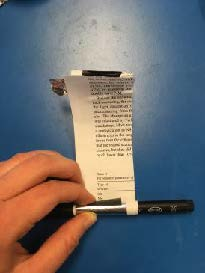
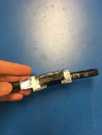
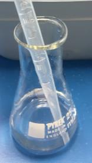
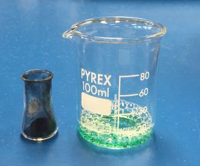
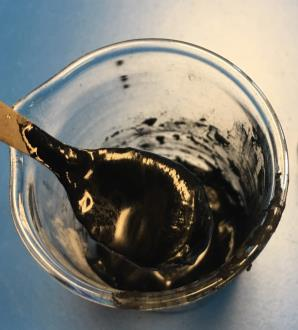
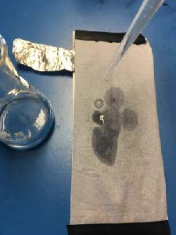
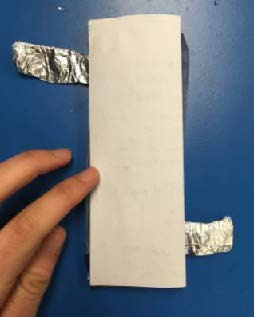
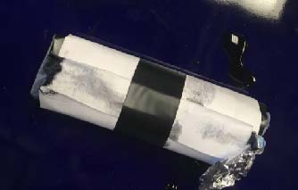
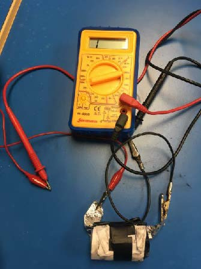

# 超极电容

## 简介

常规电容器是由非导电（=绝缘）材料（例如纸）隔开的一对薄导电板（例如金属）。 平板也可以也可以卷成圆柱体以使之更加小巧。 超级电容器是一种相对新型的电容器，类似于电池，它可以存储更多电能，而且充放电的速度比电池快。 

在本实验中，你将制作一个电容器和一个超级电容器，并使用万用表测试其性能。 

## 实验器材清单

1. 2张薄纸板或打印纸 
2. 盐水
3. 2条铝箔
4. 清洗液
5. 1把剪刀 
6. 活性炭 
7. 1个塑料移液器 
8. 1把药匙或小勺 
9. 1个100 mL烧杯，2个小瓶 
10. 1卷防水胶带 

## 方法

### 步骤A：准备电极

1.将薄纸板或打印纸切成矩形。

2.将一块铝箔切成与1相同的形状，但稍小一些。 

3.在边缘上用一些胶带将箔纸粘贴到矩形纸上。 撕下其中一个边缘上的一些铝箔（如图所示），以便将一块箔纸粘在纸上。 现在我们有一个电极。 、

4.重复步骤1~3，这样你就有了两个电极。 

### 步骤B：制作电容器 

5.将一个电极放在另一个电极上，即将这些层按纸/箔/纸/箔的顺序堆叠。 **确保两张铝箔矩形之间没有相互接触！** 

6.把一支笔芯将堆叠的电极卷成圆柱体。 确保铝箔面朝外。 尽可能将其包紧致。 用胶带将其固定，然后取出笔。 现在您有了一个**电容器**。 请转到**步骤G**进行测试。 

### 步骤C：制作导电膏

7.向烧杯加入3~4勺活性炭。 

8.向活性炭中加入几滴清洗液和盐水，充分搅拌以制成浓稠的糊状物。 试验每种成分的最佳比例以获得花生酱似的一致性。 

|                                                              |                                                              |                                                              |
| ------------------------------------------------------------ | ------------------------------------------------------------ | ------------------------------------------------------------ |
|  |  |  |

### 步骤D：铺涂导电膏

9.重复步骤A，制作另一套两个电极。

10.将导电膏铺涂在两个电极的铝箔上。 

### 步骤E：滴电解液 

11.用一块矩形的纸巾覆盖其中一个电极。 用胶带固定边缘。

12.将盐水（充当电解质）滴到薄纸上，直到整个表面湿润为止。 

### 步骤F：制作超极电容器🚧

13.组装两个电极； 这次两个铝箔面应面对面。 这意味着堆叠的顺序为纸/箔/膏/膏/纸巾/膏/箔/纸。 

14.按照第6步的方法卷起叠起的电极。 最后，用胶带将其固定，你就制成了一个超级电容器。 

### 步骤G：测试电容器和超级电容器

15.将铝箔的两末端连接到万用表。

16.将量程切换到2000kΩ的电阻范围。 这将向电容器或超级电容器施加一定的电压。 

17.再将量程切换到600V的直流电压范围，并查看电压示数。 

18.重复16~17，但这次从200Ω开始。

19.你也可以测量2000kΩ→10A和200Ω→10A的响应。

20.测量时电压或电流示数是否保持恒定？ 

21.如果在测量响应之前较长时间（≈30秒）施加电压，这些值是否会改变？

22.电容器和超级电容器的响应之间的存在哪些差异？ 为什么会有这些差异呢呢？ （提示：回顾你制作它们的方式） 

### 清理

我们今天使用的材料并不危险，因此你可以将所有垃圾丢入垃圾桶。

- 任何溢出物应使用纸巾擦拭。 
- 将所有固体废物放入提供的垃圾箱。 
- 将液体废物（盐水，清洁剂）倒入水槽。
- 将所有器材放回原处。 